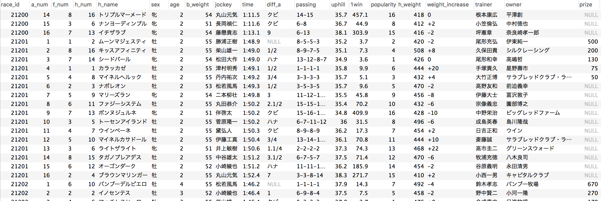
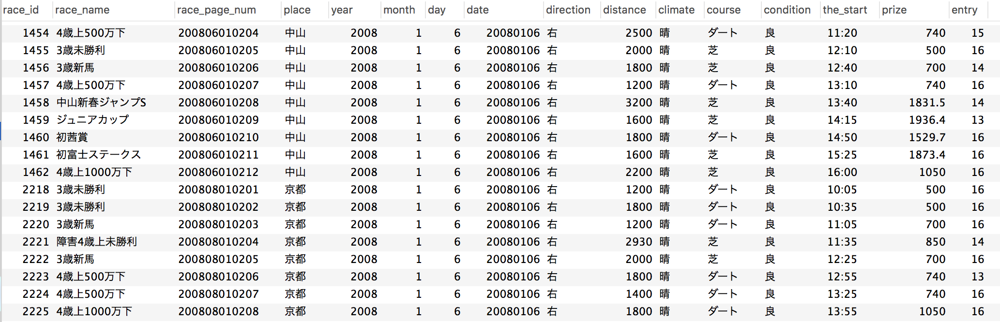

# keiba
競馬予測（取り組み中）

## DBテーブル情報
table               | description
:------------------ | :-------------
horse_info_in_race  | 各レースにおける各出走馬の情報、及び結果
races               | 各レース情報
horse_info          | 馬情報

## horse_info_in_raceテーブル情報
column         | type   | example        | description
:------------- | :----- | :------------- |:----------
race_id        | INTEGER| 21201          |レースID（racesテーブルと紐づく）
a_num          | INTEGER| 2              |着番
f_num          | INTEGER| 8              |枠番
h_num          | INTEGER| 16             |馬番
h_name         | STRING | キッスアフィニティ|馬名
sex            | STRING | 牡             |性別
age            | INTEGER| 2              |年齢
b_weight       | INTEGER| 55             |斤量
jockey         | STRING | 柴山雄一        |騎手
time           | STRING | 1:49.0         |タイム
diff_a         | STRING | 1/2            |着差
passing        | STRING | 8-9-7-5        |通過
uphill         | FLOAT  | 35.1           |上り
1win           | FLOAT  | 7.3            |単勝オッズ
popularity     | INTEGER| 4              |人気
h_weight       | INTEGER| 508            |馬体重
weight_increase| STRING | +8             |前回との増減量
trainer        | STRING | 久保田貴        |調教師
owner          | STRING | シルクレーシング  |馬主
prize          | FLOAT  | 200            |賞金[万円]

### horse_info_in_raceテーブル

## racesテーブル情報
column         | type   | example        | description
:------------- | :----- | :------------- |:----------
race_id        | INTEGER| 21201          |レースID（horse_info_per_raceテーブルと紐づく）
race_name      | STRING | 2歳未勝利       |レース名
race_page_num  | STRING | 201403030502   |スクレイピング用ページ番号
place          | STRING | 福島            |競馬場の所在
year           | INTEGER| 2014           |年
month          | INTEGER| 11             |月
day            | INTEGER| 1              |日
date           | INTEGER| 20141101       |日付（年/月/日）
direction      | STRING | 右             |周回方向（右・左）
distance       | INTEGER| 1800           |競走距離[メートル]
climate        | STRING | 小雨            |天候（晴・曇・小雨・雨・小雪・雪）
course         | STRING | 芝              |コース（芝・ダート）
condition      | STRING | 良              |コース状態（良・稍重・重・不良）
the_start      | STGING | 10:20          |発走時間
prize          | FLOAT  | 500            |このレースの最高賞金[万円]
entry          | INTEGER| 16             |出走馬数

### racesテーブル

## horse_infoテーブル情報  
column           | type   | example        | description
:----------------| :----- | :------------- |:----------
id               | INTEGER| 20005          |馬ID
h_name           | STRING | ショウナンラージャ|馬名
status           | STRING | 抹消            |登録情報（現役/抹消）
sex              | STRING | 牡              |性別
color            | STRING | 青鹿毛          |馬の毛色
course_aptitude  | INTEGER| 116            |コース適性（高:芝, 低:ダート）
course_aptitude  | INTEGER| 58             |距離適性（高:短距離, 低:長距離）
race_type        | INTEFER| 116            |脚質（高:逃げ, 低:追込）
growth           | INTEFER| 1              |成長（高:早熟, 低:晩成）
omobaba          | INTEFER| 116            |重馬場適性（高:得意, 低:苦手）
birthday         | STRING | 2012/2/13      |生年月日
trainer          | STRING | 須貝尚介         |調教師
owner            | STRING | 国本哲秀         |馬主
breeder          | STRING | 中原牧場         |生産者
producefrom      | STRING | 日高町           |産地
seri             | STRING | NULL            |セリ取引価格
total_prize_chuo | FLOAT  | 235             |獲得賞金（中央競馬）
total_prize_chiho| FLOAT  | 37              |獲得賞金（地方競馬）
total_race       | INTEGER| 12              |レース出場回数
total_win        | INTEGER| 1               |勝数
total_result     | STRING | 1-3-2-6         |[1着-2着-3着-それ以外]の回数
father           | STRING | ディープインパクト  |父親
pat_grandfa      | STRING | サンデーサイレンス  |祖父（父方）
pat_grandmo      | STRING | ウインドインハーヘア|祖母（父方）
mother           | STRING | ショウナンラノビア  |母親
mat_grandfa      | STRING | フレンチデピュティ  |祖父（母方）
mat_grandmo      | STRING | ショウナンアクシア  |祖母（母方）  

